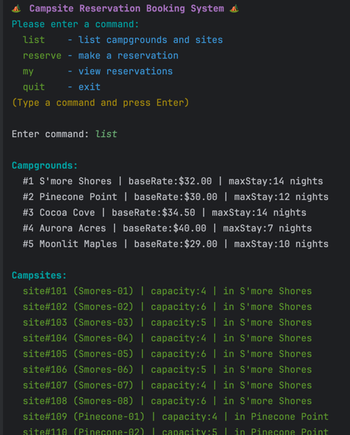
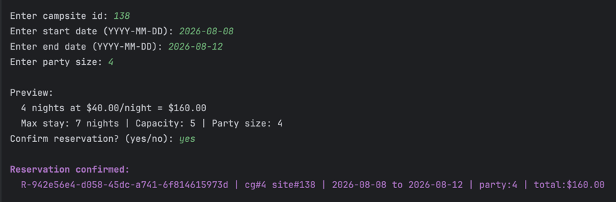
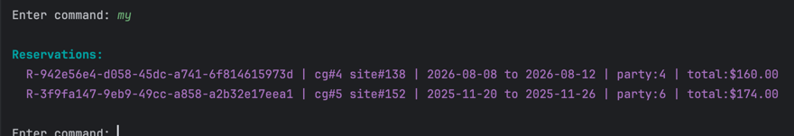
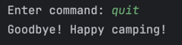
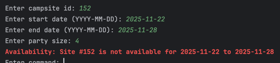

# Programming I (420-G10-HR)

# Assignment 3 – Camping Reservations System 🏕️

Date assigned: November 13, 2025  
Due date: November 28, by EOD (11:59PM)  

---

## Learning Objectives

Upon successful completion of this assignment, the student will be able to:
1. Compile and execute a simple Java program.
2. Create and use classes and objects with both static and instance members
3. Throw and catch Exceptions
4. Read and write to files
5. Create JUnit test cases

---

## Marking Scheme

| Component                                 | Mark |
|-------------------------------------------|------|
| Milestone 1 progress                      | 10   |
| Main implementation & exceptions handling | 18   |
| Domain models                             | 12   |
| FileUtil                                  | 15   |
| ReservationService                        | 10   |
| Unit tests                                | 20   |
| Output formatting & completeness          | 10   |
| Git commit etiquette                      | 5    |
| Readability & coding conventions          | 10   |
| **Total**                                 | 110  |

## Setup & Submission
- [ ] READ THE ENTIRE ASSIGNMENT FIRST before starting (including the marking scheme above), so you understand ALL requirements and the breakdown of the assignment.
- [ ] Clone and use the provided starter project in this repository. All code must be committed and pushed here.
- [ ] Before starting, RUN the starter project first! See what I have given you and how you can use it to start off.
- [ ] Commit and PUSH up your changes often! There are marks for proper Git commit etiquette. If you are working in multiple places, `git pull` your changes before continuing.
- [ ] Kat will review your code and provide feedback & final marks via the Feedback Pull Request after the assignment deadline.

---

## Camping Reservations System 🏕

### Overview
Create a Java program called "Camping Reservation System", which allows users to browse & book campsites at a National Park.

---

## Milestone 1: November 18
This lab period will be used to make progress on Assignment 3. A mark of 0/10 will be given if you do not show up or if you do not use the lab period to work on the milestone.  

## Camping Reservation System commands
If the user enters a command that is not within this list, throw an `InvalidCommandException`.

- list: lists out all the campgrounds AND all the campsites at the National Park  
  

- reserve: allows the user to make a booking for a specific campsite, prompting the user for: campsite id, start date, end date, party size, and validating all of the inputs. If everything is valid, display a preview of their booking including the calculation for how much the total will be, and ask them to confirm. If they say no, then print "Reservation cancelled". If they say yes, then write the reservation to the reservations file, and display their reservation confirmation details to the screen!     
  

- my: lists all reservations that have been booked.    
  

- quit: Exits the program  
  

## Class requirements & functionality
You must follow the requirements below. You may add additional classes & methods to improve readability, maintainability, and testability if you wish.
### 1) Domain models
Implement the following classes:
- `Campsite`
    - private attributes AND public getters for: campsite ID, campground ID, campsite name, campsite max party size (maximum occupancy)
    - constructor that takes all attributes
    - instance method called isValidPartySize that takes an integer party size as a parameter, and returns a boolean based on if the number of guests in the party is less than or equal to the maximum occupancy
    - instance method called display that takes no parameters, and returns a String that has all the attributes formatted nicely to be used for displaying to the user
- `Campground`
    - private attributes AND public getters for: campground ID, campground name, cost per night, max number of nights you can stay there
    - constructor that takes all attributes
    - instance method called isValidNumberOfNights that takes an integer number of nights as a parameter, and returns a boolean based on if the number of nights is less than or equal to the max number of nights you can stay there
    - instance method called display that takes no parameters, and returns a String that has all the attributes formatted nicely to be used for displaying to the user
- `Reservation`
    - private attributes AND public getters for: reservation ID, campground ID, campsite ID, start date, end date, party size, total price
    - constructor that takes all attributes
    - instance method called display that takes no parameters, and returns a String that has all the attributes formatted nicely to be used for displaying to the user

### 2) `ReservationService`
All methods in this class should be static, and you should look at the Error handling section further down in the assignment which Exception(s) to throw and when
- static methods for parsing user inputs that return the appropriate data type
- static method called calculateNights that takes a start date and an end date as parameters, and returns an integer based on how many nights they are staying
- static method called calculateTotalPrice that takes a number of nights and a nightly rate as parameters, and returns a double which is the total price of the booking
- static method called isSiteAvailable that takes a campsite ID, a start date, and an end date as parameters, and returns a boolean true if it is available for booking
- static method called validateAndCreateRequest that takes a Campground object, a Campsite object, a start date, an end date, and a party size. It returns a `Reservation` object if it is a valid booking. Hint: you can take advantage of the other methods in ReservationService, AND you will use what is returned here to then pass to your FileUtil.appendReservation method!

### 3) `FileUtil`
This file must include the following, and see the section following this for extra info regarding file reading & writing:
- 3 static final constants that store the file paths/names
- static method called `getCampgroundById` that takes a campground ID as a parameter, returns a `Campground` object with data based on the matching line from the campgrounds file, and throws an `InvalidCommandException` if the ID does not exist in the file
- static method called `getCampsiteById` that takes a campsite ID as a parameter, returns a `Campsite` object with data based on the matching line from the campsites file, and throws an `InvalidCommandException` if the ID does not exist in the file
- static method called `appendReservation` that takes a reservation object as a parameter, does not return anything, and appends the reservation data to the reservations file (see File reading & writing section below for details on how exactly to store each line in the file)
- static method called `printAllCampgrounds` that takes no parameters, returns nothing, and displays all campgrounds to the screen
- static method called `printAllCampsites` that takes no parameters, returns nothing, and displays all campsites to the screen
- static method called `printAllReservations` that takes no parameters, returns nothing, and displays all reservations to the screen

### 4) `Main`
Your Main class will use a mixture of loops, try/catches, and control flow to run the main program and user interactions:
- Keep prompting the user to enter a command until they enter 'quit', this means if they enter anything invalid the program should KEEP RUNNING and let them try again (see System commands section for more details)
- Call methods in your `FileUtil` and `ReservationService` to read from/write to files, display info to the user, and perform necessary calculations
- Remember to catch any Exceptions that are being thrown from `ReservationService` and `FileUtil` and handle them accordingly (see Error handling section for more details), and display appropriate messages to the user

## File reading & writing
I have given you 2 files to read from representing the campgrounds and campsites at the National Park.
You will also be writing to a reservations file to keep track of the user bookings.

### campgrounds.txt
This contains all the different campgrounds you can stay in. Each line represents a single campground.    
The format for each line is: campground ID, campground name, cost per night, max number of nights you can stay there

### campsites.txt
This contains all campsites from every campground you can reserve at the National Park.  
The format for each line is: campsite ID, campground ID, campsite name, campsite max party size (maximum occupancy)

### reservations.txt
This file does not yet exist. You will be writing to this file when the user creates a new reservation for a campsite.  
The format for each line must be: reservation ID, campground ID, campsite ID, start date, end date, party size, total price

## Error handling
You MUST use all Exceptions I have provided you with. When you handle an Exception, depending on the type you must display a relevant message to the user so they know what happened.  

### Campsite IDs
When making a reservation, the user must input a valid campsite id. If the campsite id does not exist, throw an `InvalidCommandException`.

### Reservation dates
When making a reservation, the dates must follow these rules:
- start date must be before end date, otherwise throw a `DateRangeParseException`.
- start date and end date cannot be the same date, otherwise throw a `DateRangeParseException`.
- start date must be in the future (cannot book in the past), otherwise throw a `DateRangeParseException`.
- start date and end date must be non-empty and non-null, otherwise throw a `DateRangeParseException`.

### Party size
When making a reservation, the user must enter a party size that follow these rules:
- party size must be 1 or more, otherwise throw an `InvalidCapacityException`.
- party size must be less than or equal to the campsite's capacity, otherwise throw an `InvalidCapacityException`.

### Availability
When making a reservation, the user's reservation request must follow these rules:
- if a date range falls within any existing reservation for that specific campsite id, it is not allowed, so throw an `OverbookingException`.
- if the number of nights exceeds the campground's max stay rule, then throw a `MaxStayExceededException`.

## Unit testing
You must include unit tests for the following classes (no need to test anything in FileUtil). I will be marking the tests based on how we have been practicing in the labs:
- `Campground`
- `Campsite`
- `Reservation`
- `ReservationService`

## Technical requirements & assumptions
- You MUST only use approaches and code we have formally learned in Programming I so far, otherwise marks will be deducted accordingly, unless you have talked to me about using it first. Everything we have learned through lectures, labs, and activities is more than enough for you to complete this assignment. If you are unsure of something, reach out to me
- You MUST use all custom Exceptions I have provided you with, and you may create additional ones if you desire
- reservations.txt must be APPENDED to, not overwritten with each time you run the program
- Use either `LocalDate` or `LocalDateTime` for all dates in the program
- Assume that all text files you are reading from have correct formatting and structure (no need to handle malformed lines). If you accidentally write to reservations.txt with bad data, remember you can simply delete the file and regenerate it again
- You do not have to match my output colours and formatting in my screenshots. As long as it is clear to the user what is happening, you may output however you like, but note that there are marks for formatting & completeness

## Good luck!! 💫